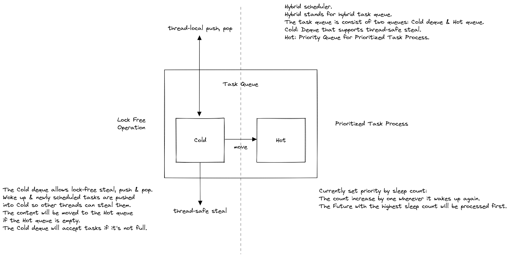

# Hybrid Queue for Prioritized Work Stealing

This section described a Hybrid queue used with the Work-Stealing strategy.

## Why?
Since the async runtime requires the task to be yielded if the I/O action
returns `EWOULDBLOCK`/`EAGAIN`, a task may be interrupt multiple times before
it actually progressed. This will happen if there are multiple tasks accessing
the same resource at the same time, some tasks may unfortunately be yielded
by the design way much more times than others.

To encounter this problem, an obvious solution is to use a priority queue and
set those with more yield count a higher prioritties to balance the possible
yield count.

But for me, a concurrent priority queue with a high performance is sadly
too hard for me to invent. With no other solutions available, I came out
an idea to use a composed data structure, just like using two stacks to
implement a queue.

The priority of a task is included in `FutureIndex`, called `sleep_count`.
`sleep_count` will be increased eachtime a related `Waker` is woke by the `Reactor`,
that is, the task had yielded for once. When tasks are loaded into the `hot` queue,
it will use this count as each task's priotrity.

## Structure
The structure and the functions can be described by the follwoing diagram:


The details can be found in the texts of the diagram.

## Modifications from `WorkStealingScheduler`
This scheduler works pretty much the same as the `WorkStealingScheduler`, with some modifications.

### 1. `worker` queue
The `worker` queue's type is replace by `TaskQueue` we defined:
```rust
struct TaskQueue {
    cold: Ringbuf<FutureIndex>,
    hot: PriorityQueue<FutureIndex, usize, BuildHasherDefault<FxHasher>>,
}
```

### 2. Run loop
Because the `worker` is now using `TaskQueue` as its queue, we need to modify the run loop to the following:
```rust
impl TaskRunner {
    fn run(&mut self) {
        'outer: loop {
            if let Some((index, _)) = self.queue.hot.pop() {
                super::process_future(index, &self.task_wakeup_sender);
            } else {
                log::debug!("Start collecting tasks...");
                // Step 1. cold -> hot
                log::debug!("Cold to hot");
                let mut push = false;
                if !self.queue.cold.is_empty() {
                    push = true;
                    // cold -> hot
                    while let Some(index) = self.queue.cold.pop() {
                        self.queue.hot.push(index, index.sleep_count);
                    }
                }
                if push {
                    continue;
                }
                // Step 2. pull from wakeups
                log::debug!("Collecting wokeups...");
                let mut recv_count = 0;
                loop {
                    match self.task_wakeup_receiver.try_recv() {
                        Ok(index) => {
                            if let Err(index) = self.queue.cold.push(index) {
                                reschedule(index);
                            }
                            recv_count += 1;
                        }
                        Err(TryRecvError::Empty) => break,
                        Err(TryRecvError::Disconnected) => break 'outer,
                    }
                }
                if recv_count > 0 {
                    // we aren't starving, no need to steal.
                    continue;
                }
                // Step 3. steal
                log::debug!("Try stealing tasks from other runners...");
                if let Ok(index) = self.inject_receiver.try_recv() {
                    if let Err(index) = self.queue.cold.push(index) {
                        reschedule(index);
                    }
                    continue;
                }
                if let Some(index) = self.steal_task() {
                    if let Err(index) = self.queue.cold.push(index) {
                        reschedule(index);
                    }
                    continue;
                }
                // Step 4. wait
                log::debug!("Runner park.");
                let exit_loop = Selector::new()
                    .recv(&self.task_wakeup_receiver, |result| match result {
                        Ok(index) => {
                            if let Err(index) = self.queue.cold.push(index) {
                                reschedule(index);
                            }
                            false
                        }
                        Err(_) => true,
                    })
                    .recv(&self.notify_receiver, |result| match result {
                        Ok(Message::HaveTasks) => {
                            if let Ok(index) = self.inject_receiver.try_recv() {
                                if let Err(index) = self.queue.cold.push(index) {
                                    reschedule(index);
                                }
                            }
                            false
                        }
                        Ok(Message::Close) | Err(_) => true,
                    })
                    .wait();
                if exit_loop {
                    break 'outer;
                }
            }
        }
    }
}
```
As you can see, we replace all `worker` actions with `queue.cold`,
and add a part to load task from `cold` to `hot` at the beginning in the `else` part.
