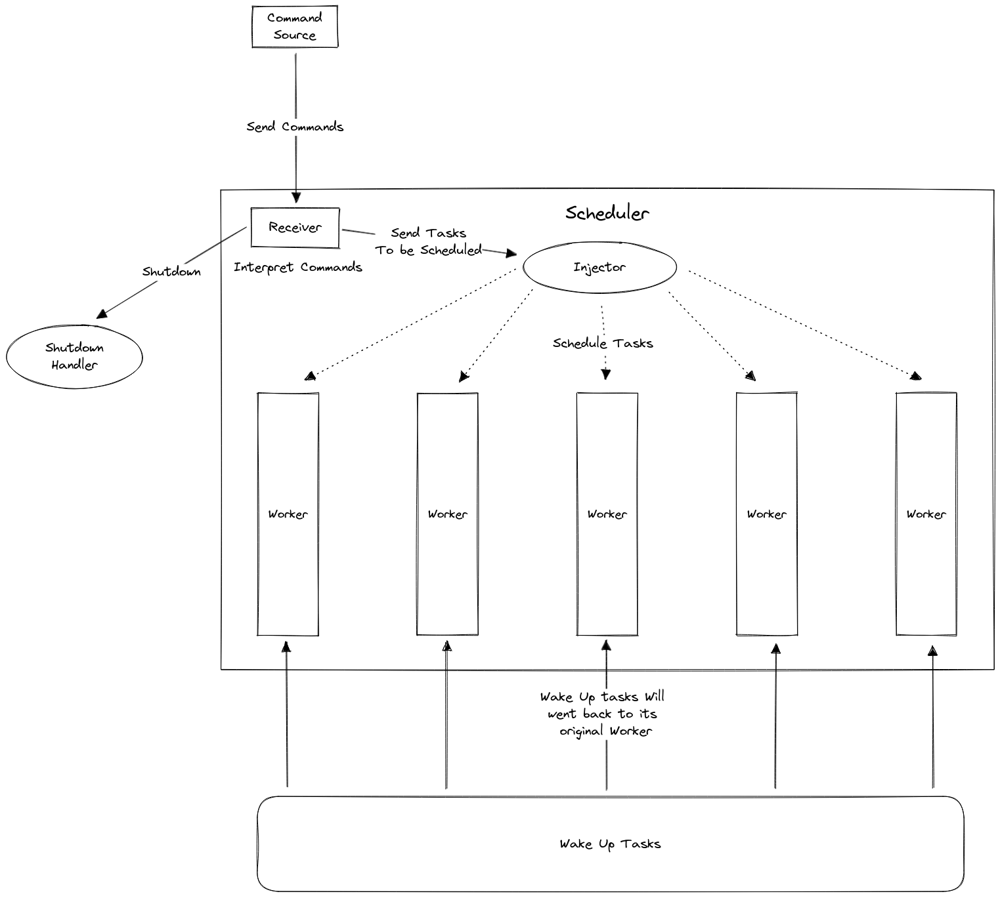

# The procedure of task scheduling
The procedure can be showned as a diagram:

1. The command sources will send command to the receiver.
2. The receiver will then handle the commands
    - If shutdown is received, run shutdown handler to shutdown the workers and join the threads.
    - Otherwise send the tasks to the injector.
3. The injector will distributed the tasks to the workers to execute
4. The tasks that are woke up will be send back to the worker it was originally scheduled.
