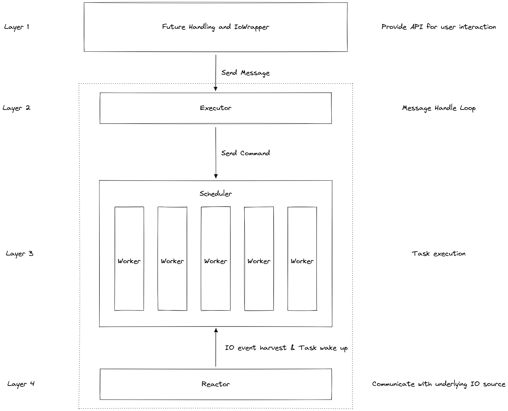

# Overview of an executor's architechture

The diagram of the executor's architechture:

By the above diagram, we can divide the executor into 4 layers:

## First Layer - Future and IoWrapper
The job of this layer is provide user interaction with the executor in a convenient way.
A global spawner is provided to send command to the executor to spawn an async function or to shutdown the executor.
The spawned function will return a join handle to join and retrieve the return value of that function.

`IoWrapper` is provided for convenient `AsFd` type wrapping. It also provides `ref_io` and `mut_io` for those
IO actions that is not predefined to run as async.

## Second layer - Executor
This is the surface of the executor. The main job of this layer is to handle message from the spawner and command
the underlying scheduler and reactor by corresponding message.

The executor itself will also set up the global spawner, scheduler with all the worker threads, and the reactor thread
on init for the runtime to work. After the executor is initialized, the user is required to `block_on` a single main
async function to fire up the runtime.

## Third layer - Scheduler
This layer will adapt the defined scheduling strategy to schedule async tasks to the workers.
The provided `Scheduler` trait is an abstract layer that defines a scheduler's basic behavior for executor to use.
This is crutial for new scheduling strategy to be able to plug into this runtime easily.

Currently, `RoundRobinScheduler`, `WorkStealingScheduler`, and `HybridScheduler` is implemented by default.

## Fourth layer - Reactor and Waker Handling
This layer will communicate with the system and harvest all IO events repoted. Once the IO events are harvested,
the reactor will:

1. If there are wakers registed related to a event, wake it up.
2. If not, store it to a table for later usage.

Since the underlying call is handled by `mio` that is edge-triggered, we need to check the stored events
with currently registered wakers to make sure every event is consumed.

The datails of the layer will be discussed later in the following chapters, but first, I will give an implementation
of a single-threaded executor to help you understand the main idea of an executor, then we'll move on to the multi-threaded version.
